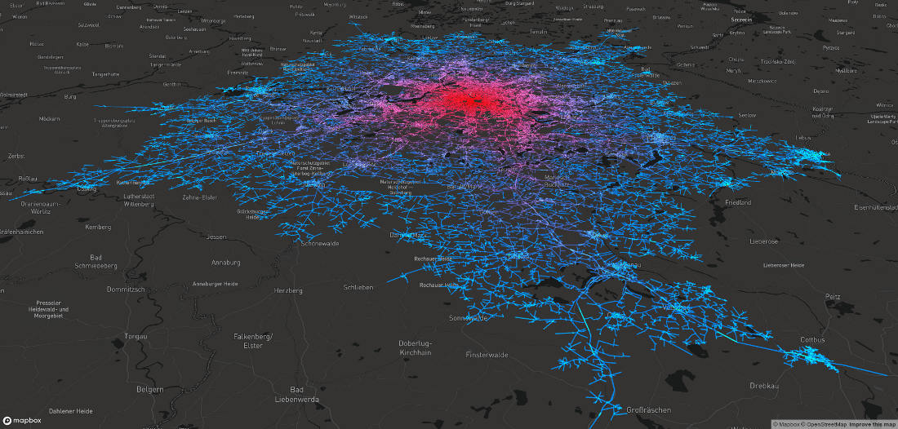

# Isochrone Experiments

For these [isochrone](https://en.wikipedia.org/wiki/Isochrone_map) experiments you need a modified GraphHopper core server:

```bash
git clone https://github.com/graphhopper/graphhopper
cd graphhopper
git checkout isochrone-edgelist
./graphhopper.sh web your-area.pbf
```

*Update*: A similar way is now possible with a stable release via gzipped CSV since 0.13 (not a binary format). See [this PR](https://github.com/graphhopper/graphhopper/pull/1577).

## License

This project stands under the Apache License 2.0.

## Deck.gl Usage

This version uses a binary edgelist returned from the customized graphhopper
server set up above.

```bash
git clone https://github.com/graphhopper/isochrone-experiments
cd isochrone-experiments
git checkout deckgl
cd deckgl
# deck.gl requires a not too old npm version, I installed 10.x via nvm, then do:
npm install
# https://www.maptiler.com/cloud/
export Token=<your maptiler api key>
npm start
```



## Mapbox GL JS

uses the native response via result=edgelist which is 5 times smaller (1) compared to the 'compact' JSON edge list
(mapbox-json folder)

```bash
git clone https://github.com/graphhopper/isochrone-experiments
cd isochrone-experiments
git checkout deckgl
cd mapbox-json
npx http-server
http://127.0.0.1:8081/index.html?key=<mapbox key>
```

## Isochone as Vector Tile Source

See mvt folder and result=mvt

Too many problems at the moment:

 * couldn't get it display the mvt (size is small but according to vtzero it
   is a valid mvt)
 * it takes ages to create the mvt with the used Java lib (>10sec)
 * mapbox fetches the vector tiles per tile resulting in multiple calls where we would just need one
